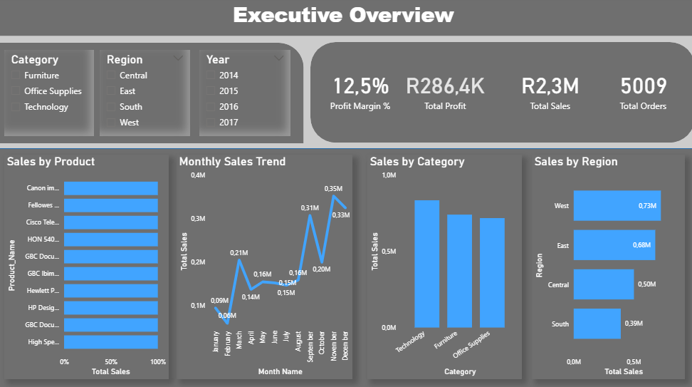
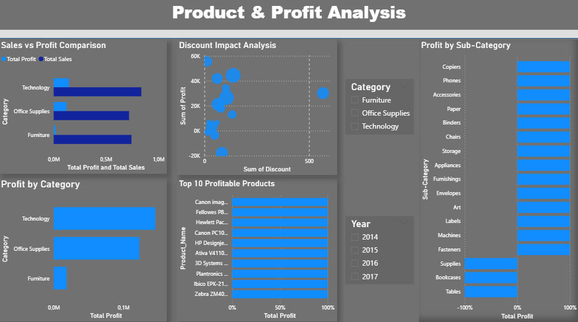

# FUTURE_DS_01 – Business Sales Performance Analytics

## 📌 Project Overview
This project presents an interactive Power BI dashboard built using the Superstore dataset. The dashboard analyzes sales performance, profitability, regional trends, and product-level insights to support data-driven business decisions.

The goal of this project was to transform raw CSV data into meaningful visual insights using data modeling, DAX measures, and interactive reporting.

---

## 🛠 Tools & Technologies Used
- Power BI
- DAX (Data Analysis Expressions)
- Power Query (Data Cleaning & Transformation)
- CSV Dataset

---

## 📈 Key Performance Indicators (KPIs)
- Total Sales
- Total Profit
- Profit Margin %
- Total Orders
- Average Order Value

---

## 📊 Dashboard Features
- Monthly Sales Trend Analysis
- Sales by Region
- Sales by Category
- Top 10 Profitable Products
- Discount Impact on Profit (Scatter Analysis)
- Interactive Slicers (Year, Region, Category)

---

## 🔍 Key Insights

- Technology category generates the highest overall profit.
- Furniture shows strong sales volume but lower profit margins.
- The West region contributes the highest sales performance.
- Higher discount levels negatively impact profitability.
- A small group of products drives a significant portion of total profit.

---

## 💡 Business Recommendations

- Increase marketing focus on high-margin Technology products.
- Re-evaluate discount strategy to protect profit margins.
- Improve pricing or cost control strategies in Furniture category.
- Expand operations in high-performing regions.
- Focus inventory planning on top-performing products.

---

## 📷 Dashboard Preview

### Executive Overview

### Product & Profit Analysis

---

## 🚀 Project Outcome
This project demonstrates skills in:
- Data cleaning and transformation
- Data modeling
- DAX measure creation
- Business insight generation
- Interactive dashboard design

---

📎 Author: Tshiamo  
Aspiring IT & Data Professional
